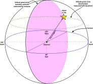

# 测量模型

## 目的

Kepler 项目围绕一个核心观念构建：

> 科学知识来自对物理世界进行不完美的测量，并对这些测量中的不确定度进行审慎的推理。

本项目以肉眼天文学作为具体而在历史上真实的场景，让参与者制作简易仪器、收集观测，并用统计与机器学习方法去推断背后的物理过程。重点不在于复刻专业天文学，而在于理解证据是如何被产生、评估与积累的。

Kepler 并不把单次观测看作对物理世界潜在状态的直接测量，而是看作对该状态的**约束**。一个测得的高度角、方位角或角距，并不能直接确定一个天体的位置。相反，每一次观测都贡献一份证据，缩小可能解释的范围。科学理解正是通过推断把许多这样的约束结合起来而涌现的。

本文档定义了贯穿项目每一个组成部分的概念性测量模型。仪器设计、观测规程、数据模式、模拟、统计推断、机器学习与课程材料，都应与这一模型保持一致。

------------------------------------------------------------------------

# 测量过程

本项目把每一次观测都视为下述因果过程的一次实现：

``` text
太阳系
      ↓
可观测的天空
      ↓
仪器
      ↓
观测者
      ↓
测量
      ↓
数据集
      ↓
推断
      ↓
科学理解
      ↓
科学传达
```

每一个环节都在引入信息的同时，也可能引入不确定度、偏差或误差。

本项目的目的不是消除这些不完美，而是刻画它们、并对它们进行推理。

------------------------------------------------------------------------

# 环节 1 —— 太阳系

太阳系的物理状态独立于观测者而存在。

例如：

- 行星位置
- 行星速度
- 地球自转
- 地球轨道位置
- 月球位置
- 恒星参考系

这些量共同定义了物理世界的**潜在状态**。参与者从不直接观测到这个状态。参与者从不直接观测到它们。

------------------------------------------------------------------------

# 环节 2 —— 可观测的天空

物理状态在特定地点与时刻产生出一片视天空。

这一环节包含如下效应：

- 观测者的纬度与经度
- 日期与时间
- 地球自转
- 大气折射
- 地平遮挡
- 能见度条件

可观测的天空是天体力学与测量之间的接口。

------------------------------------------------------------------------

# 环节 3 —— 仪器

仪器把可观测的天空转化为可测量的量。

项目初期聚焦于参与者自制的简易仪器，例如：

- 十字杆
- 象限仪

每件仪器都具有可测的属性，包括：

- 设计版本
- 制作材料
- 尺寸
- 校准历史
- 估计的精度

仪器被视为测量过程的一部分，而不仅仅是一件被动的工具。

------------------------------------------------------------------------

# 环节 4 —— 观测者

观测者使用仪器产出测量。

观测者贡献了自身的特性，包括：

- 经验
- 校准技巧
- 一致性
- 记录的准确性
- 判断决策

可以预期，在完全相同的条件下，不同观测者会产出系统性不同的测量结果。

这种变异是本项目的特性，而不是缺陷。

------------------------------------------------------------------------

# 环节 5 —— 测量

测量是本项目记录的首要观测数据。

每一次测量都记录了在一组特定观测情境下、可观测天空的某项属性。

例如：

- 角距

- 高度角

- 方位角

- 时间戳

- 校准测量

尽管这些测量常常被当作可以直接确定天球坐标来对待，Kepler 采取的是另一种视角。

**每一次测量都是对物理世界未知状态的一个约束。**

例如：

- 一次高度角测量约束了天体在天球上可能的位置；

- 一次方位角测量贡献了一个独立的方向约束；

- 一次角距测量约束了两个天体的相对位置。

{width="6in"}

没有任何单次观测能够完全确定潜在状态。

科学理解，来自把在不同时间、不同地点、用不同仪器、由不同观测者收集的许多独立约束结合起来。

每一次测量都附有元数据，描述其获得时的具体情境。

测量是不可变的记录。

修正、校准或质量评估应当另行存储，而不是替换掉原始观测。

------------------------------------------------------------------------

# 环节 6 —— 数据集

单次测量只有在汇总之后才变得有用。

项目数据集包含：

- 观测
- 观测者
- 仪器
- 观测地点
- 校准记录
- 课程轮次
- 环境信息

因此，数据集同时表征了天文观测本身，以及产出这些观测的完整测量过程。

------------------------------------------------------------------------

# 环节 7 —— 推断

推断把观测约束结合起来，以估计物理世界的潜在状态。

本项目有意支持多种进路。

例如：

- 描述统计
- 回归模型
- 层次贝叶斯模型
- 状态空间模型
- 高斯过程
- 监督机器学习
- 无监督学习
- 异常检测
- 深度学习

在项目架构中，没有任何一种推断方法享有特权地位。

推断方法应当被看作是对同一批观测相互竞争的解释。

------------------------------------------------------------------------

# 环节 8 —— 科学理解

科学理解来自把模型与观测相互比对。

参与者应当把科学体验为一个如下的迭代过程：

1.  提出解释，
2.  收集证据，
3.  精炼模型，
4.  评估不确定度，
5.  改进预测。

因此，本项目强调科学推理，而非获得正确答案。

------------------------------------------------------------------------

# 环节 9 —— 科学传达

科学理解只有在能够被传达之后才变得持久。

我们鼓励参与者不仅传达自己的结论，也传达产出这些结论的观测、假设、方法、不确定度与推理过程。

传达使得研究能够被他人检视、复现、批评、精炼与拓展。

因此，科学论证成为测量过程的一部分，而不只是一份最终报告。

------------------------------------------------------------------------

# 模拟

模拟在本项目中占据一个独特的位置。

模拟器从一个已知的潜在状态出发，通过对测量过程的每一个环节建模，生成合成观测。

这使得推断方法可以在底层真值已知的受控条件下接受评估。

模拟支持：

- 软件开发
- 模型验证
- 教学练习
- 基准测试
- 模型恢复研究

模拟架构应在实际可行的范围内，尽可能贴近真实的测量过程。

------------------------------------------------------------------------

# 设计原则

本项目遵循若干指导原则。

## 先测量

观测应当始终先于推断。

模型是为了解释测量而建立的，不是为了生成测量。

## 保全溯源信息

原始观测绝不应被覆盖。

派生量应当始终能够从原始测量可复现地推得。

共享的社区标准之所以存在，是为了让独立收集的观测可以互操作，同时保全每一次测量的溯源信息。

## 对不确定度建模

不确定度是科学测量的本质属性。

目标是理解不确定度，而不是消除它。

## 支持多种推断框架

本仓库应当鼓励在统计方法与机器学习方法之间进行比较。

架构决策应避免让任何单一实现或软件生态享有特权。

## 从简单组件搭起

本项目应当先从简易的仪器、简单的观测与简单的推断进路开始，之后再引入更多复杂性。

------------------------------------------------------------------------

# 范围

Kepler 项目无意复刻专业天体测量学，也无意与现代天文巡天相竞争。

它的目的，是营造一个丰富而真实的测量环境，让参与者可以在其中学习：

- 观测科学，
- 测量理论，
- 不确定度量化，
- 统计推断，
- 机器学习，
- 可复现研究，
- 协作式科学实践。

天文学提供的是场景。

推断才是主题。

科学推理是最终目标。

------------------------------------------------------------------------

> 译自英文原版 [`docs/measurement-model.md`](measurement-model.md)，对应提交 `f8171a6`（2026-08-16）。英文版为权威版本；如两者不一致，以英文版为准。
