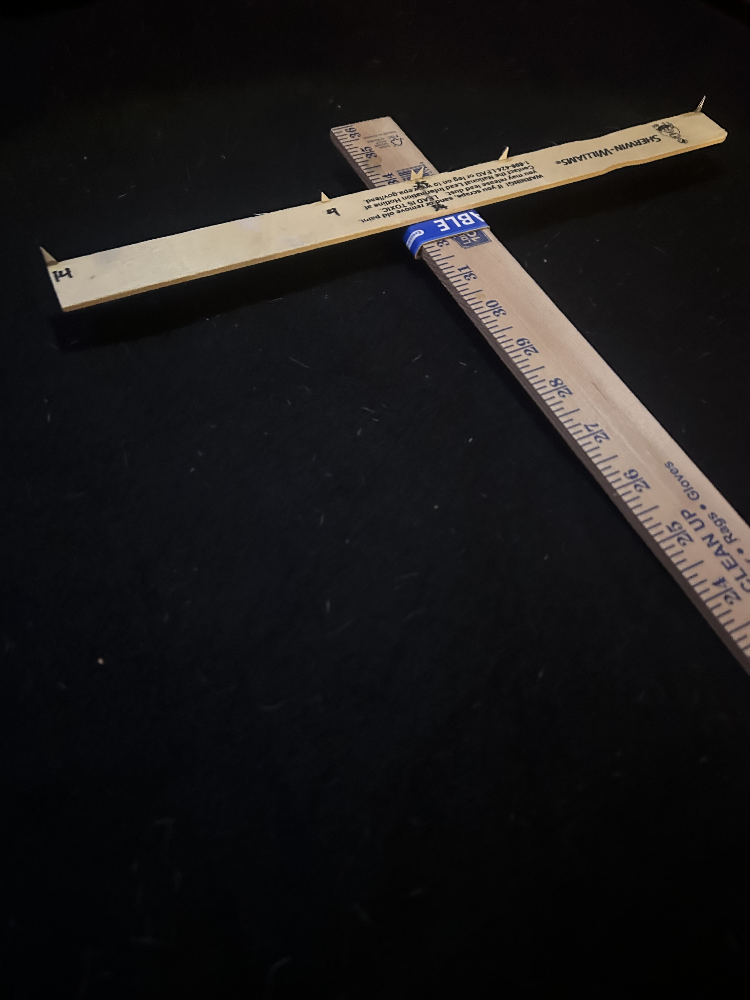
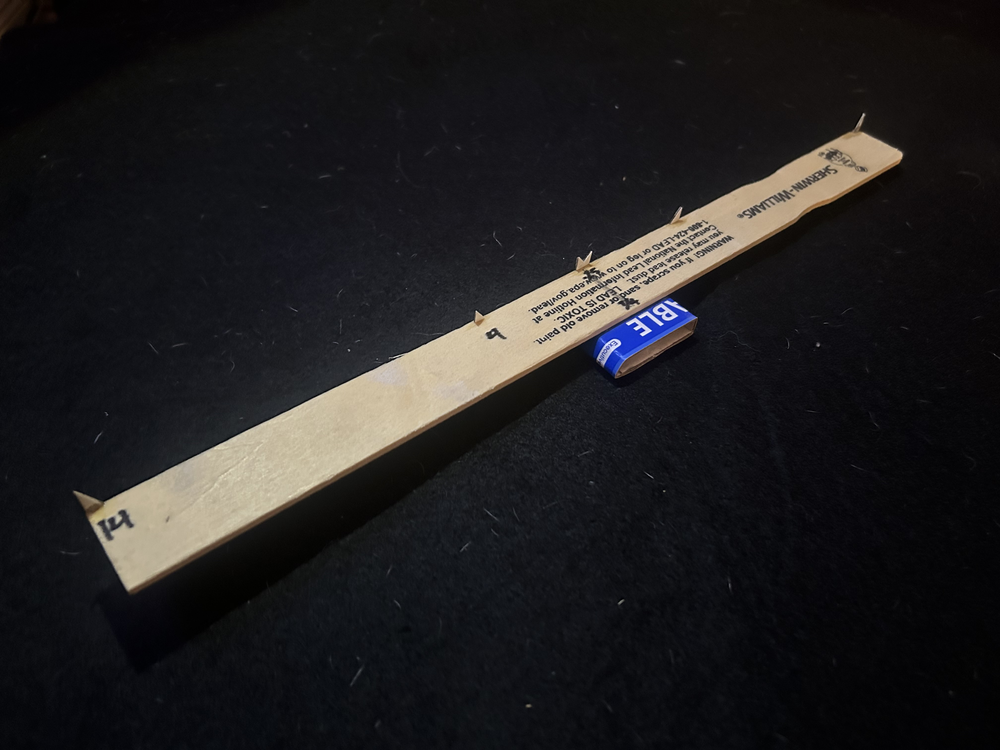

# Kepler Cross-staff Build Guide

> **Status:** Prototype 0.2
>
> This document describes the construction of the current Kepler Cross-staff prototype. The instrument is designed to be inexpensive, easy to reproduce, and suitable for iterative refinement through observation and measurement.

------------------------------------------------------------------------

# Purpose

The Kepler Cross-staff is a simple angular measuring instrument for terrestrial and astronomical observations.

This prototype emphasizes:

- ease of construction
- repeatable measurements
- modular design
- inexpensive materials

Future revisions may alter individual components while preserving the overall design philosophy.

------------------------------------------------------------------------

# Bill of Materials

## Required Materials

| Quantity | Item                         |
|----------|------------------------------|
| 1        | Wooden yardstick             |
| 1        | Wooden paint stir stick      |
| 1        | Thin cardboard (≈1 mm thick) |
| —        | Super glue                   |
| —        | Pencil                       |

## Tools

- ruler
- scissors or hobby knife
- cutting mat (recommended)

------------------------------------------------------------------------

# Reference Photographs

## Completed Instrument



*Figure 1. Completed Prototype 0.2.*

------------------------------------------------------------------------

## Crosspiece Detail



*Figure 2. Sliding sleeve and fiducial assembly.*

------------------------------------------------------------------------

# Construction

## 1. Prepare the Main Staff

Select one face of the yardstick as the measurement face.

Keep the factory graduations visible.

Choose one end as the observing end and mark the reverse side:

```         
EYE
```

This orientation should remain fixed throughout use.

------------------------------------------------------------------------

## 2. Build the Sliding Sleeve

Cut a strip of thin cardboard.

Wrap it around the yardstick and glue the ends together to form a rectangular sleeve.

The sleeve should:

- slide smoothly
- fit snugly
- resist rotation
- move without excessive friction

Do **not** glue the sleeve to the yardstick.

------------------------------------------------------------------------

## 3. Attach the Crosspiece

Locate the midpoint of the paint stir stick.

Mark it lightly with pencil.

Glue the crosspiece to the front face of the sleeve so that:

- it is centered on the sleeve
- it remains perpendicular to the yardstick
- it is rigid after curing

Allow the glue to cure fully before continuing.

------------------------------------------------------------------------

## 4. Install the Fiducials

Construct three permanent fiducial pairs from thin cardboard.

Recommended separations are:

| Fiducial | Separation |
|----------|-----------:|
| Outer    |      14 in |
| Middle   |       4 in |
| Center   |    0.25 in |

### Outer and Middle Fiducials

Construct each fiducial from a small triangular piece of cardboard.

Glue the fiducials to the outer edge of the crosspiece.

The inward-facing points define the measurement span.

Keep the fiducials approximately 6 mm (1/4 in) high.

------------------------------------------------------------------------

### Center Fiducial

Construct the center fiducial from a single piece of cardboard.

Cut a narrow V-shaped notch so that the two inward-facing points are separated by approximately 0.25 inches.

Measure and record the actual tip-to-tip separation after construction.

The fiducial points—not the cardboard edges—define the measurement span.

------------------------------------------------------------------------

## 5. Measurement Index

Draw a fine pencil line on the sleeve aligned with the fiducial edge of the crosspiece.

This index line is used when reading the yardstick.

All measurements should reference this line.

------------------------------------------------------------------------

# Inspection

Verify the following before use.

- Sleeve slides freely.
- Sleeve does not rotate noticeably.
- Crosspiece remains perpendicular.
- Fiducials are firmly attached.
- Measurement index is clearly visible.
- Yardstick graduations remain readable.

Correct any problems before calibration.

------------------------------------------------------------------------

# Initial Familiarization

Before making astronomical observations, practice on terrestrial objects.

Suggested targets include:

- cabinet knobs
- books
- door frames
- windows
- picture frames

Choose the fiducial pair appropriate for the target.

Slide the sleeve until the target exactly spans the two fiducial points.

Read the staff position from the measurement index.

Repeat several times to develop consistent technique.

------------------------------------------------------------------------

# Engineering Notes

Record observations during construction and testing.

Examples include:

- sleeve friction
- sleeve wear
- ease of alignment
- preferred fiducial range
- instrument stability
- repeatability
- unexpected difficulties

Experience should guide future revisions.

------------------------------------------------------------------------

# Next Steps

After construction:

1.  Validate the instrument using terrestrial objects of known dimensions.
2.  Develop a calibration table.
3.  Compare measured and expected angular separations.
4.  Begin astronomical observations.
5.  Record proposed design improvements in `design.md`.
