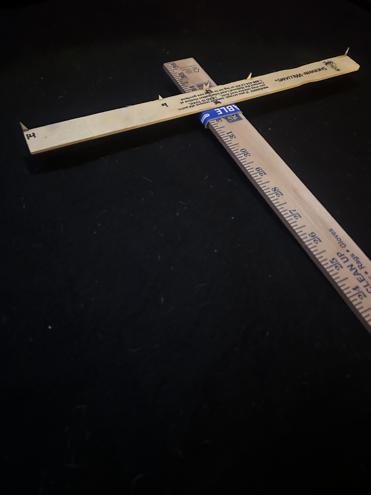
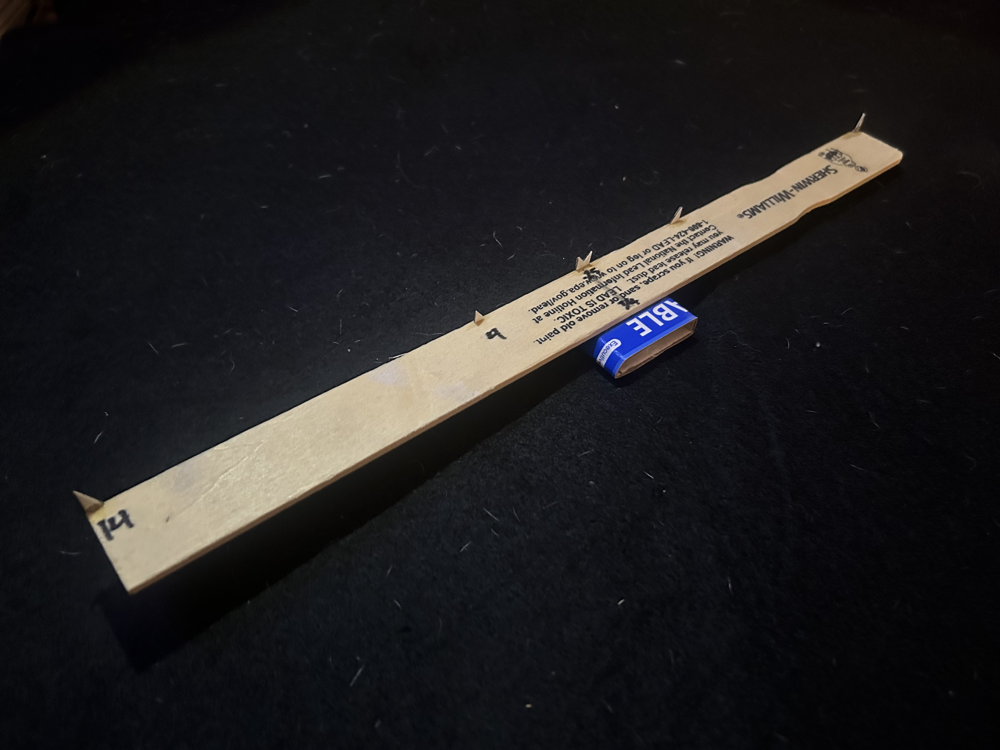

# Kepler 十字杆制作指南

> **状态：** 原型 0.2
>
> 本文档描述当前 Kepler 十字杆原型的制作方法。该仪器的设计目标是廉价、易于复制，并适合通过观测与测量不断迭代改进。

------------------------------------------------------------------------

# 目的

Kepler 十字杆是一件用于地面与天文观测的简易角度测量仪器。

本原型着重于：

- 制作简便
- 测量可重复
- 模块化设计
- 材料廉价

未来的版本可以在保持整体设计理念的前提下改动个别部件。

------------------------------------------------------------------------

# 材料清单

## 所需材料

| 数量 | 物品                     |
|------|--------------------------|
| 1    | 木制码尺                 |
| 1    | 木制油漆搅拌条           |
| 1    | 薄纸板（约 1 mm 厚）     |
| —    | 强力胶                   |
| —    | 铅笔                     |

## 工具

- 直尺
- 剪刀或美工刀
- 切割垫（建议备有）

------------------------------------------------------------------------

# 参考照片

## 成品仪器



*图 1. 完成后的原型 0.2。*

------------------------------------------------------------------------

## 横杆细部



*图 2. 滑套与基准标组件。*

------------------------------------------------------------------------

# 制作步骤

## 1. 准备主杆

选定码尺的一面作为测量面。

保持出厂刻度可见。

选定一端作为观测端，并在其反面标注：

```         
EYE
```

使用过程中应始终保持这一朝向不变。

------------------------------------------------------------------------

## 2. 制作滑套

裁下一条薄纸板。

把它绕在码尺上，将两端粘合，形成一个矩形滑套。

滑套应当：

- 滑动顺畅
- 贴合紧凑
- 不易转动
- 移动时摩擦不过大

**不要**把滑套粘死在码尺上。

------------------------------------------------------------------------

## 3. 安装横杆

找到油漆搅拌条的中点。

用铅笔轻轻标出。

把横杆粘到滑套的正面，使其：

- 在滑套上居中
- 与码尺保持垂直
- 固化后保持刚性

在继续之前，让胶水完全固化。

------------------------------------------------------------------------

## 4. 安装基准标

用薄纸板制作三对永久性基准标。

建议的间距为：

| 基准标 |     间距 |
|--------|---------:|
| 外档   |    14 英寸 |
| 中档   |     4 英寸 |
| 中心   |  0.25 英寸 |

### 外档与中档基准标

每个基准标用一小片三角形纸板制成。

把基准标粘到横杆的外缘。

朝内的尖端定义了测量跨距。

基准标高度保持在约 6 mm（1/4 英寸）。

------------------------------------------------------------------------

### 中心基准标

中心基准标由一整片纸板制成。

切出一个狭窄的 V 形缺口，使两个朝内的尖端相距约 0.25 英寸。

制作完成后，测量并记录尖端到尖端的实际间距。

定义测量跨距的是基准标的尖端，而不是纸板的边缘。

------------------------------------------------------------------------

## 5. 测量基准线

在滑套上画一条细铅笔线，与横杆装有基准标的那一面对齐。

读取码尺时以这条基准线为准。

所有测量都应以这条线为参照。

------------------------------------------------------------------------

# 检查

使用前请确认以下各项。

- 滑套滑动自如。
- 滑套没有明显转动。
- 横杆保持垂直。
- 基准标粘接牢固。
- 测量基准线清晰可见。
- 码尺刻度依然可读。

在校准之前先纠正所有问题。

------------------------------------------------------------------------

# 初步熟悉

在进行天文观测之前，先拿地面物体练手。

建议的目标包括：

- 柜门拉手
- 书本
- 门框
- 窗户
- 相框

为目标选择合适的那一对基准标。

滑动滑套，直到目标恰好跨满两个基准标尖端之间。

从测量基准线读出杆上的位置。

反复练习若干次，形成稳定一致的操作手法。

------------------------------------------------------------------------

# 工程记录

在制作与测试过程中记录观察到的情况。

例如：

- 滑套摩擦
- 滑套磨损
- 对准的难易程度
- 偏好使用的基准标档位
- 仪器稳定性
- 重复性
- 意料之外的困难

经验应当指导未来的版本修订。

------------------------------------------------------------------------

# 后续步骤

制作完成之后：

1.  用尺寸已知的地面物体验证仪器。
2.  编制校准表。
3.  比较测得的角距与预期角距。
4.  开始天文观测。
5.  把提议的设计改进记入 `design.md`。

------------------------------------------------------------------------

> 译自英文原版 [`instruments/cross-staff/build-guide.md`](build-guide.md)，对应提交 `d43fe91`（2026-07-21）。英文版为权威版本；如两者不一致，以英文版为准。
