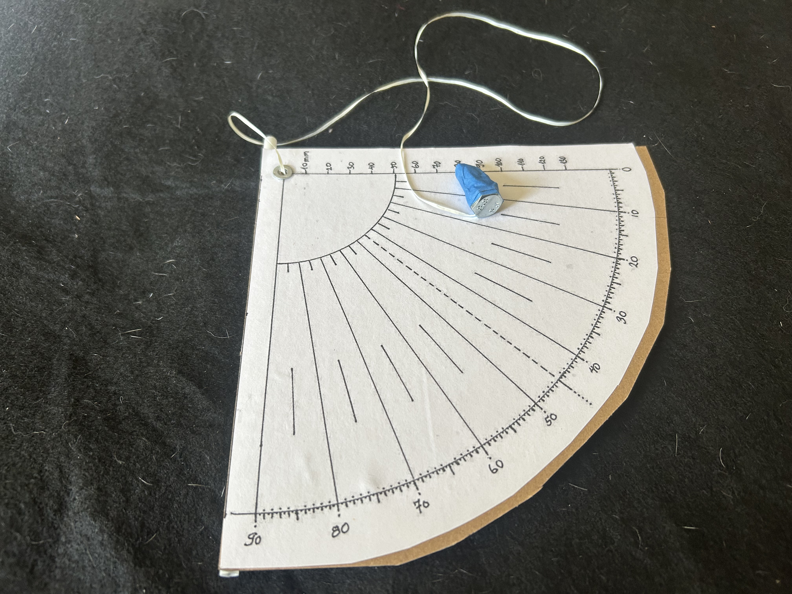
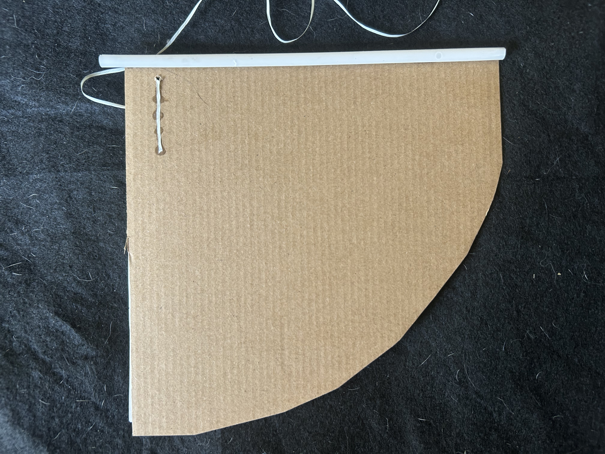
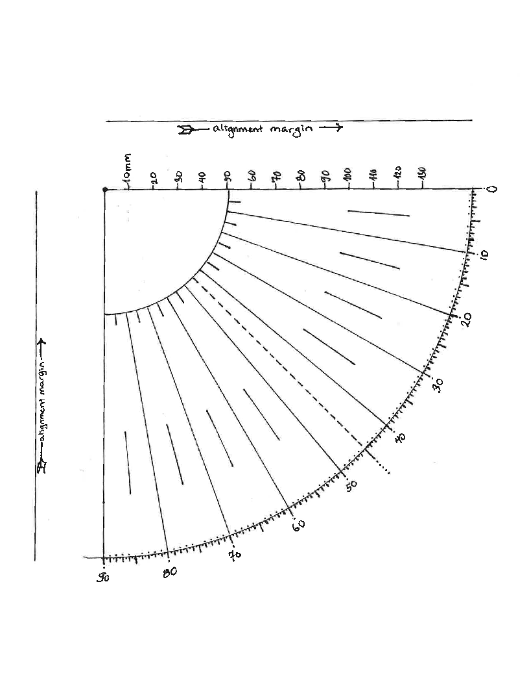

Este documento describe la construcción del cuadrante de referencia de
Kepler.

El objetivo es producir un instrumento económico, robusto y
reproducible, adecuado para observaciones astronómicas y uso educativo.
El diseño de referencia favorece deliberadamente la accesibilidad, la
simplicidad mecánica y la calidad de las mediciones por encima de la
fidelidad histórica.

El primer cuadrante Kepler está diseñado para construirse utilizando
materiales económicos disponibles en ferreterías, tiendas de
manualidades, papelerías o comercios de venta general.

Esquema de referencia:

{width="3.5in" height="4in"}

------------------------------------------------------------------------

# Objetivos de Diseño

El instrumento terminado debe ser:

- económico;
- fácil de construir utilizando herramientas comunes;
- mecánicamente robusto;
- fácil de calibrar;
- cómodo de utilizar;
- suficientemente preciso para investigaciones científicas;
- fácilmente reproducible por constructores independientes.

Se da prioridad a la reproducibilidad y a la simplicidad por encima de
la fidelidad histórica.

------------------------------------------------------------------------

# Diseño de Referencia

El cuadrante de referencia consta de:

- un cuerpo rígido de cartón;
- un transportador impreso o una escala de cuadrante impresa;
- un estante de mira angosto de cartón;
- un tubo de mira montado sobre la superficie posterior;
- un pivote reforzado para la plomada;
- una plomada con un peso suspendido.

A diferencia de muchos cuadrantes educativos, el cuerpo estructural
**no** se recorta siguiendo el contorno de la escala impresa. En su
lugar, la escala impresa se monta sobre un sustrato rígido que
proporciona rigidez y una referencia estable para el sistema de
puntería.

La esquina inferior derecha del cuerpo está achaflanada para
proporcionar espacio libre para la plomada, preservando al mismo tiempo
la resistencia estructural del instrumento.

{width="3.5in" height="4in"}
{width="3.5in" height="4in"}

------------------------------------------------------------------------

# Materiales

## Estructura

Recomendados:

- cartón corrugado;
- cartón laminado.

Se pueden laminar capas adicionales para aumentar la rigidez.

Siempre que sea posible, utilice un borde recto cortado en fábrica (por
ejemplo, el borde de una caja de cartón) como el **borde superior** del
instrumento. Este borde sirve como la referencia principal para la
alineación del sistema de puntería.

## Escala Angular

Recomendados:

- transportador impreso en papel;
- cuadrante impreso en papel.

La escala impresa debe montarse de manera que el borde recto del
cuadrante quede perfectamente paralelo al borde superior del
instrumento.

No es necesario recortar la hoja impresa, siempre que las graduaciones
permanezcan completamente visibles.

Se proporciona una escala graduada de cuadrante lista para imprimir y
montar sobre la cara frontal del instrumento en
`images/quadrangle_mod.pdf`:

{width="3.5in"
height="4in"}

Imprima el PDF al **100 % de escala** (sin escalado de página ni la
opción "ajustar a la página") antes de pegarlo sobre la cara frontal del
cuadrante.

## Sistema de Puntería

Recomendados:

- popote (pajilla) de plástico;
- popote (pajilla) metálico;
- tubo rígido de plástico.

El tubo de mira se monta sobre la **cara posterior** del instrumento,
inmediatamente debajo del estante de mira, utilizando una unión adhesiva
a todo lo largo.

Montar el tubo sobre la superficie posterior proporciona:

- mayor rigidez;
- mayor superficie de adhesión;
- menor movimiento rotacional;
- alineación consistente con el estante de mira.

## Estante de Mira

El estante de mira es una tira angosta de cartón fijada a lo largo del
borde superior del instrumento.

Su propósito es proporcionar una referencia mecánica recta que alinee y
sostenga el tubo de mira montado en la parte posterior.

El estante no está diseñado para apoyar el rostro ni para utilizarse
como asa.

## Pivote

Recomendado:

- ojal metálico pequeño para papel.

El ojal refuerza el pivote y proporciona una superficie de apoyo
duradera para la plomada.

Debe mantenerse un pequeño margen de cartón por encima del cuadrante
impreso, de modo que el ojal quede instalado dentro del cuerpo del
instrumento y no atravesando la unión entre el cuerpo y el estante de
mira.

## Plomada

Recomendados:

- cordón trenzado de nailon;
- hilo de pescar;
- cordón sintético fino.

La plomada debe colgar libremente sin interferencias.

## Peso de la Plomada

Algunas opciones posibles incluyen:

- arandela de acero;
- tuerca hexagonal;
- pequeño peso de latón.

Ejemplo mostrado: tornillo hexagonal zincado M8-1.25 × 20 mm.

El peso debe quedar suspendido por debajo del borde inferior del
instrumento en todo el rango previsto de medición.

------------------------------------------------------------------------

# Adhesivos

Recomendados:

- pegamento PVA (pegamento blanco o para madera).

Siempre que sea posible, el adhesivo debe aplicarse sobre toda la
superficie de contacto.

El diseño evita deliberadamente depender de refuerzos metálicos
adheridos con pegamento. El ojal de papel proporciona el refuerzo
mecánico necesario.

------------------------------------------------------------------------

# Herramientas Necesarias

Las herramientas típicas incluyen:

- tijeras o cuchillo de uso general;
- regla;
- impresora;
- pegamento;
- perforador o punzón;
- herramienta para colocar ojales.

------------------------------------------------------------------------

# Resumen de la Construcción

1.  Prepare un cuerpo rígido de cartón con un borde superior recto
    cortado en fábrica.
2.  Fije el estante de mira al borde superior.
3.  Imprima la escala del cuadrante.
4.  Pegue la escala impresa sobre la cara frontal, asegurándose de que
    su borde recto quede paralelo al borde superior del cuerpo.
5.  Deje secar el conjunto bajo peso para minimizar deformaciones.
6.  Instale el ojal de papel en el vértice del cuadrante impreso.
7.  Monte el tubo de mira sobre la cara posterior, inmediatamente debajo
    del estante de mira.
8.  Pase la plomada a través del ojal.
9.  Fije el peso de la plomada.
10. Verifique que la plomada oscile libremente en todo el rango de
    medición.
11. Realice la calibración.

------------------------------------------------------------------------

# Fundamentación del Diseño

## Cuerpo Estructural

El cuerpo funciona como el elemento estructural del instrumento y no
simplemente como un contorno decorativo.

Este diseño:

- aumenta la rigidez;
- simplifica la construcción;
- minimiza los cortes innecesarios;
- proporciona amplias superficies de montaje;
- mejora la durabilidad a largo plazo.

## Escala Impresa

La escala angular se considera un componente reemplazable y no parte de
la estructura.

Esto permite sustituirla de manera económica en caso de daño.

## Borde Superior Recto

El borde superior constituye la referencia geométrica principal del
instrumento.

Utilizar un borde cortado en fábrica mejora la alineación tanto del
estante de mira como del tubo de mira.

## Sistema de Puntería Montado en la Parte Posterior

El tubo de mira se monta detrás del cuerpo mediante una unión adhesiva a
todo lo largo.

Esto proporciona mayor rigidez y repetibilidad que los diseños con
montaje sobre el borde.

## Estante de Mira

El estante de mira alinea mecánicamente el tubo de mira y lo protege
contra la rotación durante el uso.

## Pivote con Ojal

Un ojal de papel proporciona:

- una geometría de pivote repetible;
- menor desgaste;
- mayor durabilidad;
- refuerzo mecánico sin depender de uniones metálicas pegadas.

## Chaflán de Despeje

El chaflán de la esquina inferior derecha permite que la plomada oscile
libremente a bajos ángulos de elevación, preservando al mismo tiempo
casi toda la rigidez estructural del cuerpo.

------------------------------------------------------------------------

# Calibración

Ningún cuadrante debe considerarse listo para uso científico hasta haber
completado una campaña de calibración documentada.

Siga el [**Protocolo de Calibración del
Cuadrante**](../../protocols/quadrant/calibration/protocol.md) antes de
utilizar el instrumento para observaciones astronómicas.

Para obtener información sobre el propósito, la filosofía y la
interpretación de la calibración, consulte [**Calibración del
Cuadrante**](calibration.md).

------------------------------------------------------------------------

# Revisiones Futuras

Los prototipos futuros podrán explorar:

- materiales alternativos para el cuerpo;
- construcción laminada frente a construcción de una sola capa;
- materiales alternativos para el tubo de mira;
- pesos alternativos para la plomada;
- variantes de alta precisión utilizando componentes mecanizados.

El diseño de referencia debe seguir siendo económico y ampliamente
reproducible, incluso a medida que se desarrollen variantes más
avanzadas.
