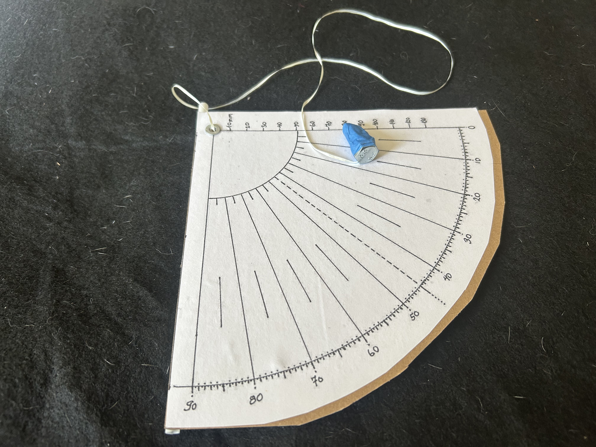
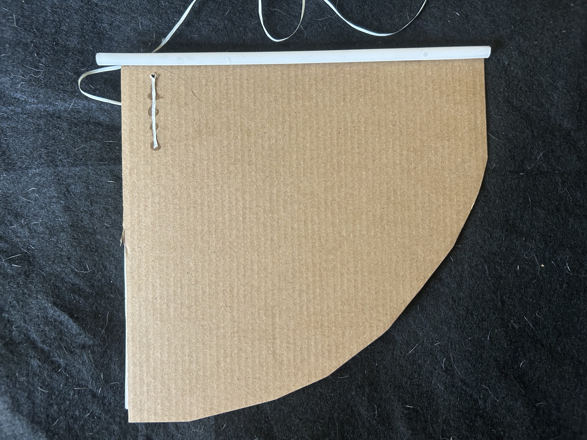
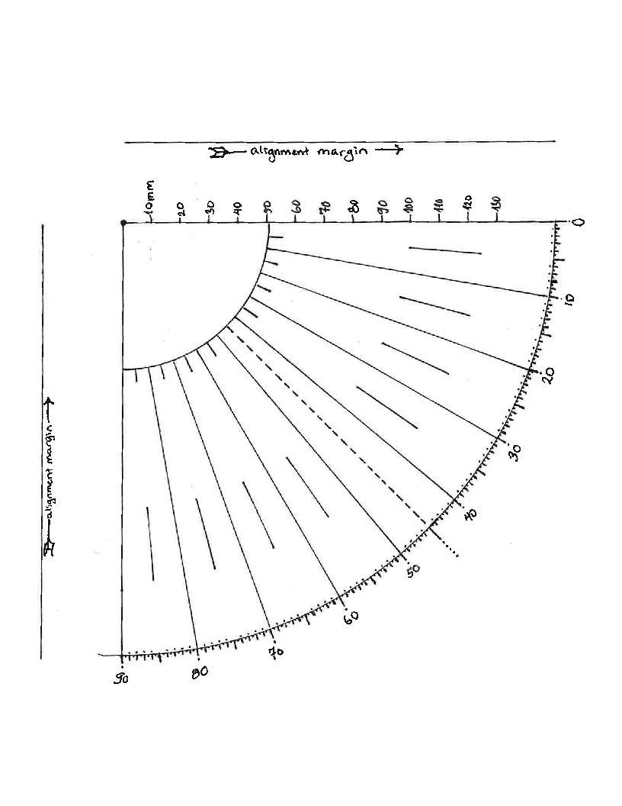

本文档描述 Kepler 参考象限仪的制作方法。

目标是做出一件廉价、结实、可重复制作的仪器，适用于天文观测与教学。参考设计有意把可及性、机械上的简单性与测量质量，置于历史真实性之上。

第一件 Kepler 象限仪的设计意图是：用五金店、手工店、办公用品店或普通零售店里买得到的廉价材料就能做出来。

参考示意图：

{width="3.5in" height="4in"}

------------------------------------------------------------------------

# 设计目标

制成的仪器应当：

- 廉价
- 用常见工具即可制作
- 机械上结实
- 易于校准
- 使用舒适
- 对科学研究而言足够准确
- 便于其他制作者独立复制

在可复现性与简单性，同历史还原度之间，优先选择前者。

------------------------------------------------------------------------

# 参考设计

参考象限仪由以下部分组成：

- 一块刚性纸板本体
- 一张打印的量角器或打印的象限刻度
- 一条窄纸板瞄准托板
- 一根安装在背面的管式照准器
- 一个加固的铅垂线枢轴
- 一条系有配重的铅垂线

与许多教学用象限仪不同，本设计的结构本体**不**按打印刻度的外形裁切。相反，打印刻度被贴装在一块刚性衬底上，由后者提供刚度，并为照准系统提供稳定的基准。

本体的右下角切去一个斜角，为垂锤让出摆动空间，同时保留仪器的强度。

{width="3.5in" height="4in"} {width="3.5in" height="4in"}

------------------------------------------------------------------------

# 材料

## 结构

推荐：

- 瓦楞纸板
- 层压纸板

可以多层叠合以增加刚度。

只要条件允许，就用一条现成的机器切割直边（例如取自纸箱）作为仪器的**顶边**。这条边是照准系统的主要对准基准。

## 角度刻度

推荐：

- 打印的纸质量角器
- 打印的纸质象限刻度

打印刻度的贴装应确保：象限的直边与仪器顶边精确平行。

只要刻度线仍然完整可见，打印纸不必裁边。

`images/quadrangle_mod.pdf` 中提供了一份可直接打印、适合贴装到仪器正面的带刻度象限图：

{width="3.5in" height="4in"}

粘贴到象限仪正面之前，请以**100% 比例**打印该 PDF（不要缩放页面，也不要选"适应页面"）。

## 照准机构

推荐：

- 塑料吸管
- 金属吸管
- 硬质塑料管

照准管用一条通长的胶缝，安装在仪器**背面**、紧贴瞄准托板下方。

把管子装在背面可以带来：

- 更好的刚性
- 更大的粘接面积
- 更小的转动位移
- 与瞄准托板始终一致的对准关系

## 瞄准托板

瞄准托板是沿仪器顶边贴装的一条窄纸板。

它的作用是提供一条笔直的机械基准，用以对准并支撑装在背面的照准管。

它不是用来贴脸的基准，也不是把手。

## 枢轴

推荐：

- 小号金属纸用气眼

气眼加固枢轴，同时为铅垂线提供一个耐用的支承面。

打印象限刻度上方应留出一小条纸板边距，使气眼安装在仪器本体之内，而不是穿过本体与瞄准托板之间的接缝。

## 铅垂线

推荐：

- 编织尼龙绳
- 钓鱼线
- 细合成纤维绳

铅垂线应能自由悬垂，不受阻碍。

## 垂锤

可选方案包括：

- 钢垫圈
- 六角螺母
- 小黄铜配重

上例中使用的是：M8-1.25×20mm 镀锌内六角圆柱头螺钉。

在整个预期测量范围内，配重都应悬于仪器底边之下。

------------------------------------------------------------------------

# 粘合剂

推荐：

- PVA（白乳胶或木工胶）

只要实际可行，胶水都应涂满整个接触面。

本设计有意避免依赖粘接的金属加固件。纸质气眼即可提供所需的机械加固。

------------------------------------------------------------------------

# 所需工具

常用工具包括：

- 剪刀或美工刀
- 直尺
- 打印机
- 胶水
- 打孔器或锥子
- 气眼安装工具

------------------------------------------------------------------------

# 制作流程概览

1.  准备一块带有笔直机器切割顶边的刚性纸板本体。
2.  把瞄准托板装到顶边上。
3.  打印象限刻度。
4.  把打印刻度粘到正面，确保其直边与本体顶边平行。
5.  让组件在重物压持下晾干，以尽量减小翘曲。
6.  在打印象限的顶点处安装纸用气眼。
7.  把照准管装到背面、紧贴瞄准托板下方。
8.  把铅垂线穿过气眼。
9.  系上垂锤。
10. 确认铅垂线在整个测量范围内都能自由摆动。
11. 执行校准。

------------------------------------------------------------------------

# 设计依据

## 结构本体

本体是仪器的结构件，而不是一圈装饰性的外形轮廓。

这样的设计：

- 提高刚度
- 简化制作
- 减少不必要的裁切
- 提供充裕的安装面
- 改善长期耐用性

## 打印刻度

角度刻度被当作可更换的部件，而不是结构的一部分。

这样在损坏时可以低成本更换。

## 笔直的顶边

顶边是仪器主要的几何基准。

使用出厂切割的边，可以改善瞄准托板与照准管两者的对准精度。

## 背面安装的照准器

照准管用通长胶缝安装在本体背面。

相比装在边缘的做法，这样能提供更好的刚性与重复性。

## 瞄准托板

瞄准托板在机械上对准照准管，同时防止它在使用中转动。

## 气眼枢轴

纸用气眼提供：

- 可重复的枢轴几何
- 更小的磨损
- 更好的耐用性
- 无需依赖粘接金属件的机械加固

## 让位斜角

右下角的斜角让垂锤在低仰角时也能自由摆动，同时几乎完整保留了本体的结构刚度。

------------------------------------------------------------------------

# 校准

任何象限仪，在完成一轮有完整记录的校准活动之前，都不应被视为可用于科学工作。

在把仪器用于科学观测之前，请遵循[**象限仪校准规程**](../../protocols/quadrant/calibration/protocol.zh.md)。

关于校准的目的、理念与解读，参见[**象限仪校准**](calibration.zh.md)。

------------------------------------------------------------------------

# 未来版本

未来的原型可能探索：

- 替代的本体材料
- 层压结构与单层结构的比较
- 替代的照准管材料
- 替代的垂锤
- 使用机加工部件的高精度变体

即便更高级的变体不断发展，参考设计也应始终保持廉价、便于广泛复制。

------------------------------------------------------------------------

> 译自英文原版 [`instruments/quadrant/build-guide.md`](build-guide.md)，对应提交 `e09bbd9`（2026-08-02）。英文版为权威版本；如两者不一致，以英文版为准。
